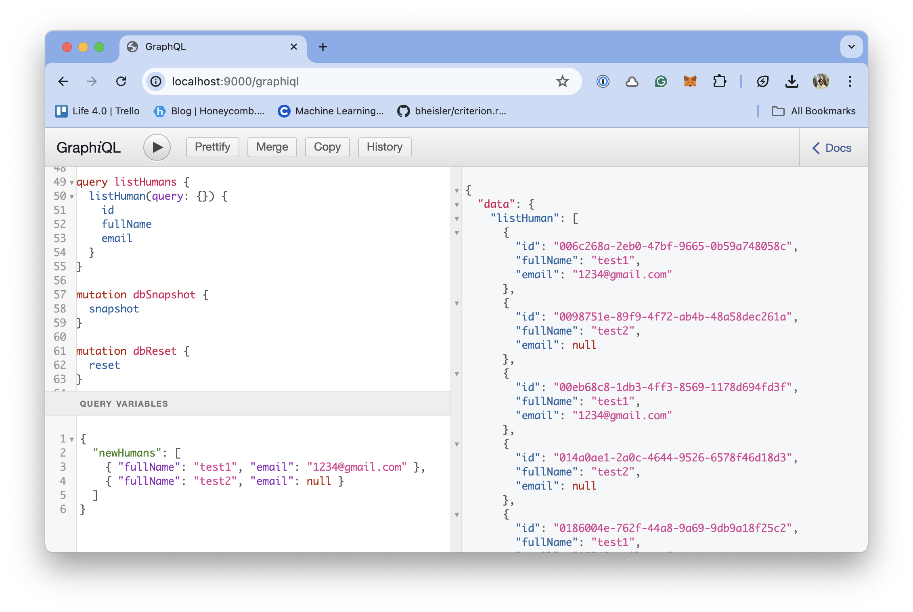

# Lineage DB 🦀 ⏰

Lineage DB is an educational MVCC database written in Rust. [Current functionality & limitations](#functionality-and-limitations). 

<p align="center">
  
</p>

*Inspired by: [High-Performance Concurrency Control
Mechanisms for Main-Memory Databases](https://vldb.org/pvldb/vol5/p298_per-akelarson_vldb2012.pdf) & [Tikhu](https://github.com/penberg/tihku)*


## Running the database

1. Go to [releases](https://github.com/Compulsed/lineagedb/releases), find a binary that matches your OS / Architecture
2. Extract the binary from the release
   1. MacOS - Allow running from unidentified developer - [Instructions](https://support.apple.com/guide/mac-help/open-a-mac-app-from-an-unidentified-developer-mh40616/mac)
3. Run `./lineagedb`, by default the database storage is stored `data/` in a directory alongside the binary
4. Open `http://0.0.0.0:9000/graphiql`
5. Examples of GraphQL queries / mutations can be found here [here](#graphql-examples)


## CLI

An optional CLI is provided for various configuration options

```
📀 Lineagedb GraphQL Server, provides a simple GraphQL interface for interacting with the database

Usage: lineagedb [OPTIONS]

Options:
  -p, --port <PORT>
          Port the graphql server will run on [default: 9000]
  -a, --address <ADDRESS>
          Address the graphql server will run on [default: 0.0.0.0]
      --log-http
          Whether to log out GraphQL HTTP requests
      --http-workers <HTTP_WORKERS>
          [default: 2]
      --storage <STORAGE>
          Which storage mechanism to use [default: file] [possible values: file, dynamo, postgres, s3]
      --data <DATA>
          When using file storage, location of the database. Reads / writes to this directory. Note: Does not support shell paths, e.g. ~ [default: data]
```
## Architecture

### Request response flow


## Developing Lineage

**Running with cargo**

```
# Default options
cargo run 

# Pass in command line arguments
cargo run -- --help
```

**Debugging**

```
# Prints out logs from the database crate (skips printing any GraphQL)
RUST_LOG=lineagedb cargo run

# Prints out full exception strings
RUST_BACKTRACE=1 cargo run

# Prints out logs from tests, note requires updating the test annotation to #[test_log::test]
RUST_LOG=debug cargo test -p database with_storage_file -- --nocapture
```

**Other binaries**

```
cargo run --package tcp-server --bin lineagedb-tcp-server
```

## Performance

Tested on an M1 Mac.

| Threads: | 1    | 2     | 3     | 4     |
|----------|------|-------|-------|-------|
| Read     | 640k | 1100k | 1400k | 1700k |
| Write    | 280k | 400k  | 150k  | 100k  |

Test notes:
- Metrics required in transactions per second
- A transaction has a single statement

**Testing / Benchmarking**

```
# Quick functional unit tests
cargo test --all

# Running performance unit tests
# Notes:
# 1. Running these tests one after another will yield different results to
#   running them individually. I suspect this could be because the OS' cleaning up allocated memory.
# 2. These tests will yield different results based on whether the laptop is charging or not
cargo test --package database "database::database::tests::bulk" -- --nocapture --ignored --test-threads=1

# Using the benchmarking tool https://bheisler.github.io/criterion.rs/book/user_guide/command_line_options.html#baselines
cargo bench --all
cargo bench -- --save-baseline no-fsync # Saves the baseline to compare to another branch
```

## Functionality and Limitations

**Current functionality**
1. Supports ACID transactions
1. Utilizes a WAL for performant writes / supports trimming the WAL
1. Time travel; query the database at any given transaction id (* assuming the previous transactions are untrimmed)
1. For any given item can look at all revisions (* assuming the previous transactions are untrimmed)
1. Supports basic querying

**Current limitations:**
1. Does not support session based transactions, statements in a transaction must be sent all at once
1. Does not support DDL statements, at the moment the system is limited to a single entity (Person)
1. The working dataset must fit entirely within memory, there is no storage pool / disk paging
1. Does not have an SQL frontend
1. Has limited querying capabilities, just `AND`, no `OR`, `IN`, etc.
1. Version compression, for each new version we make a clean copy of all of the previous versions' data
1. Uniqueness or index based querying

## GraphQL Examples

```
# Create
mutation writeHuman {
  createHuman(newHuman: { fullName: "Frank Walker" }) {
    id
    fullName
    email
  }
}

# Create builk
mutation createHumans ($newHumans: [NewHuman!]!) {
  createHumans(newHumans: $newHumans) {
    id
    fullName
    email
  }
}

{
  "newHumans": [
    { "fullName": "test1", "email": "dalejohnsalter@gmail.com" },
    { "fullName": "test2", "email": null }
  ]
}

# Update
mutation updateHuman {
  updateHuman(id: "53db1e6f-4b90-4d3d-8871-b24288bf9192", updateHuman: { email: "1233@gmail.com"}) {
    id
    fullName
    email
  }
}

# Use ID in mutation response to get the human
query queryHuman {
  human (id: "bf5567e4-1d4e-4451-aeb3-449cdd2970be") {
    id
    fullName
    email
  }
}

# List
query listHuman {
  listHuman {
    id
    fullName
    email
  }
}

query listHumanWithQuery {
  listHuman(query: { fullName: "test1" }) {
    id
    fullName
    email
  }
}

mutation dbSnapshot {
  snapshot
}


mutation dbReset {
  reset
}
```